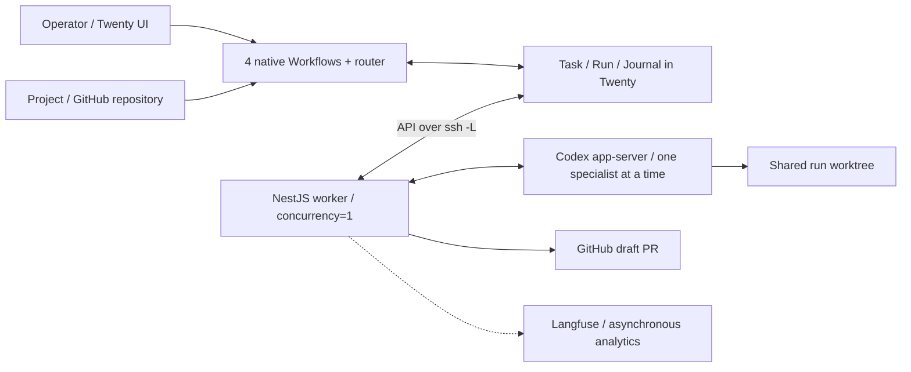

# PRD: AI orchestrator

Language: English · Version: 1.1 · Date: 6 October 2026 · Status: implementation draft.

[Русская версия](PRD.ru.md) · [Verifiable requirements](requirements.md) · [Project roadmap](ROADMAP.md)

The source specification provenance and SHA-256 are recorded in the [requirements register](requirements.md). PRD describes the product; verifiable contracts are in topic documents. Implementation and runtime validation have not been performed.

## 1. Problem and product

The operator needs a single way to delegate engineering work to AI, follow progress, answer questions, and accept results. Project context, specialist assignments, execution attempts, checks, and the PR must remain linked, including after connection failures and worker restarts.

The product is a private Twenty extension and one worker on an execution host. The operator uses the native Twenty interface. Four native Workflows own business state and the queue; a NestJS worker executes their commands through Codex app-server and publishes facts. Specialists work sequentially on one task in a shared Git worktree. A successful engineering attempt ends with a draft PR; the task ends only after human acceptance.

## 2. Users and responsibilities

| Participant | Need and responsibility |
| --- | --- |
| Operator / task owner | Describe the task and criteria, select Project, submit to the queue, answer and authorize actions, accept the result, request rework or cancellation |
| Self-host administrator | Configure the Twenty App, workflows, permissions, host, SSH, GitHub, versions, backup/restore, and retention |
| Twenty router | Propose an allowed specialist and instruction or a question; the workflow validates the decision |
| Codex specialist | Perform engineering work, request input, propose handoff, and provide check results |

The router and specialists do not accept results on behalf of the human. The worker does not own the business lifecycle. The task `owner` is responsible for answers and acceptance.

## 3. Goals and measurement

1. A complete path in Twenty: Project → task → queue → specialist → checks → PR → human acceptance.
2. Visible questions, progress, assignments, handoffs, and sequential attempts without a separate control panel.
3. Safe recovery: an unknown execution outcome blocks new tasks; network retries do not create a new Codex turn.
4. Prompt quality and human decision analytics without execution depending on Langfuse.

Pilot acceptance requires evidence for every criterion from [SAI-01 to SAI-28](requirements/acceptance.md), beyond a successful model response or configuration being present. All criteria currently remain **Not verified**.

| Metric | Definition |
| --- | --- |
| First-run acceptance rate | Tasks accepted after the first engineering run / tasks with a recorded `ACCEPT` or `REWORK` decision; tasks without a decision are shown separately |
| Check pass rate | Mandatory check results for each run; a PR does not replace checks |
| Questions and attempts | Number of questions and engineering runs per task; handoff does not count as a new run |
| Time to acceptance | From submission to the orchestrator until `ACCEPT`; distinguish active time and waiting |
| Rework reasons | Reasons for `REWORK` decisions linked to the specific run |
| Cost per accepted task | Total cost of all attempts, including failed/cancelled, only with complete information; unknown values remain empty |

The source defines no numerical quality or cost targets; these are agreed after a pilot baseline is measured. Prompt versions are compared on the same task set with a fixed model/config, retaining all versions involved in the attempts.

## 4. MVP scope

The MVP includes:

- mandatory Project with one GitHub repository
- a router agent
- multiple versioned specialist profiles
- sequential execution
- questions and approvals
- task handoff
- checks
- draft PR
- report
- human acceptance
- rework/retry
- cancellation
- time budget
- recovery
- an asynchronous LangfuseExporter

Langfuse is within pilot scope, but its availability is not a condition for execution.

Excluded from MVP:

- a custom frontend or workflow engine
- Inbox
- email/Slack notifications
- new OAuth integrations
- parallel tasks and agents
- multiple workers/hosts
- an AgentTask tree
- a separate Redis/BullMQ queue
- orchestrator Background Jobs/KV
- a local worker journal database
- dashboards
- custom timeline types
- file uploads
- sales/CRM automation
- automatic migration of old subtasks
- LLM-as-a-judge
- automatic A/B experiments

Twenty's internal infrastructure remains in place.

This product flow does not authorize automatic:

- AI retries
- acceptance
- merge
- release
- production deploy

A worktree is not a security boundary for secrets.

## 5. Main operator journey

1. Create `TODO` with description, criteria, `owner`, and mandatory Project.
2. Ensure Project references an allowed GitHub repository and base branch; the system verifies read, push, and PR creation permissions before execution.
3. Invoke “Submit to orchestrator”: the task becomes `READY`; autosave does not start execution.
4. The router selects a specialist; the workflow records a snapshot and the `START` command in Journal.
5. Once `STARTED` is confirmed, the task becomes `RUNNING`; the card shows the specialist.
6. Follow phase and concise progress in the card.
7. At `WAITING/INPUT` or `WAITING/APPROVAL`, read the question and answer or explicitly allow/deny the action through Form.
8. Confirmed continuation returns the same run, profile, and thread to execution.
9. When needed, the specialist hands the task to the next specialist through the orchestrator; task, run, worktree, and budget remain unchanged.
10. Once the whole task is complete, mandatory checks pass, and a PR exists, the card shows the report and link, and the task becomes `WAITING/REVIEW`. Only “Accept” moves it to `DONE`.

Additional flows:

- a pre-start router question creates no run
- rework after success creates a newly authorized attempt
- a GitHub failure retries publication only
- active cancellation waits for confirmed shutdown
- uncertainty after a failure requires reconciliation

## 6. Model and lifecycle

Product entities:

- Project stores business context and GitHub repository
- AI Task is the operator task
- AI Run is an engineering attempt
- AI Run Journal is durable command/event exchange

A native Workflow Run records workflow history and replaces neither AI Run nor Journal. Internal Codex steps do not create AgentTask.

Statuses, fields, transitions, and the task diagram are defined in the [model contract](requirements/domain.md). `SUCCEEDED` requires checks and a PR; `DONE` requires human acceptance. Terminal tasks are not reopened; rework before acceptance creates a newly authorized attempt.

## 7. Architecture and product invariants



Implementation boundaries:

- one worker/workspace/host
- one active run and specialist
- lifecycle in Twenty
- execution in the worker

Planned repository layout:

```bash
twenty-autonomus-ccompany/
  docs/                 # PRD and contracts
  compose.yaml          # local Twenty
  apps/
    twenty-app/         # standalone Twenty App package
  services/
    worker/             # NestJS worker, if its implementation stays here
```

The Twenty App is a standalone package in `apps/twenty-app/`. `services/worker/` is the planned location if the worker implementation is also kept in this repository; the layout records a plan, not evidence that either component has been implemented.

An unknown outcome blocks the queue. Langfuse does not block execution. Exact guarantees are REQ-23–REQ-32 in the [register](requirements.md), [protocol](requirements/protocol.md), and [recovery](requirements/operations.md).

## 8. Operator interface

Native Table/Kanban Views:

- “Queue” (`READY`)
- “In progress” (`RUNNING`)
- “Action needed” (`WAITING` with reason)
- “Completed” (`DONE`, `CANCELLED`)

The card contains:

- Project/repository
- instruction and criteria
- current specialist
- phase/progress
- attempt and handoff history
- question/answer
- report and PR
- last contact
- trace URL when available

All actions use one Single manual trigger “Task action” in Cmd+K / pinned navbar and Form:

- submit
- withdraw
- answer
- allow/deny
- accept
- request rework
- authorize retry
- retry PR publication
- cancel

The workflow validates permissions and current correlation; duplicate clicks do not create another attempt. Orchestration history is available in Workflow Runs/Versions.

## 9. Constraints, risks, and open decisions

Configurable defaults and security constraints are defined in [OPS-01–OPS-08](requirements/operations.md). These are design values, neither measured properties nor an SLA.

Before implementation, determine:

- the host and meaning of “remote server”
- SSH/API addresses
- workspace schema
- Twenty/SDK/Codex versions
- plan/quotas
- profiles/models
- credentials/policy
- project checks
- Langfuse hosting

Validate required native capabilities, Dispatch serialization, API permissions, persistent Codex threads, recovery, and shutdown in the compatibility gate. Third-party capability limits and availability statuses in the source are not treated as verified for this new repository.

Compatibility gate and open decisions are detailed in the [operations contract](requirements/operations.md).

Main risks:

- non-atomic Task/Run/Journal writes
- ambiguous network execution starts
- loss of the transient buffer on restart
- Twenty permission/quota limitations
- PR publication failures
- incomplete analytics

Mitigations and verifiable conditions are defined in the [requirements](requirements.md). During migration, old active execution must first finish or be demonstrably stopped; history is preserved, and automatic subtask migration is excluded.

## 10. Delivery and acceptance

The flat sequential stages, dependencies, current evidence, and exit conditions are in the [project roadmap](ROADMAP.md). All 28 SAI criteria remain **Not verified** until integration evidence is recorded in the [acceptance contract](requirements/acceptance.md). A working local pilot does not prove Codex app-server production readiness, release, or deploy.

This PRD and [requirements.md](requirements.md) form the design package; RU/EN use the same requirement and acceptance identifiers.
