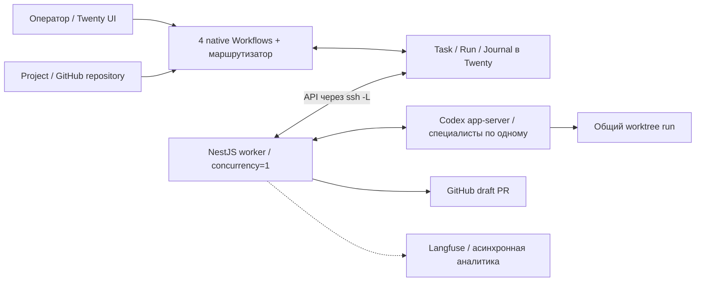

# PRD: AI-оркестратор

Язык: русский · Версия: 1.1 · Дата: 6 октября 2026 · Статус: проект для реализации.

[English version](PRD.md) · [Проверяемые требования](requirements.ru.md) · [Дорожная карта](ROADMAP.ru.md)

Основание и SHA-256 исходного ТЗ — в [реестре требований](requirements.ru.md). PRD описывает продукт; проверяемые контракты находятся в тематических документах. Реализация и runtime-проверки не выполнены.

## 1. Проблема и продукт

Оператору нужен единый способ передать инженерную задачу AI, видеть ход работы, отвечать на вопросы и принимать результат. Контекст проекта, назначения специалистов, попытки исполнения, проверки и PR должны сохраняться вместе, в том числе после сбоев связи и перезапуска worker.

Продукт — приватное расширение Twenty и один worker на машине исполнения. Оператор работает в штатном интерфейсе Twenty. Четыре native Workflows управляют бизнес-состоянием и очередью; NestJS worker выполняет их команды через Codex app-server и публикует факты. Специалисты последовательно работают над одной задачей в общем Git worktree. Успешная инженерная попытка заканчивается draft PR, а задача — только ручной приёмкой.

## 2. Пользователи и ответственность

| Участник | Потребность и ответственность |
| --- | --- |
| Оператор / владелец задачи | Описать задачу и критерии, выбрать Project, передать в очередь, отвечать и разрешать действия, принять результат, запросить доработку или отмену |
| Администратор self-host | Настроить Twenty App, workflows, доступы, host, SSH, GitHub, версии, backup/restore и retention |
| Маршрутизатор Twenty | Предложить допустимого специалиста и инструкцию либо вопрос; решение проверяет workflow |
| Специалист Codex | Выполнить инженерную работу, запросить ввод, предложить передачу и представить результат проверок |

Маршрутизатор и специалисты не принимают результат за человека. Worker не управляет бизнес-lifecycle. Ответственность за ответы и приёмку закреплена в `owner` задачи.

## 3. Цели и оценка результата

1. Полный путь в Twenty: Project → задача → очередь → специалист → проверки → PR → ручная приёмка.
2. Прозрачные вопросы, прогресс, назначения, передачи и последовательные попытки без отдельной панели управления.
3. Безопасное восстановление: неизвестный исход прежнего выполнения блокирует новые задачи; сетевой повтор не создаёт новый Codex turn.
4. Аналитика качества промптов и человеческих решений без зависимости исполнения от Langfuse.

Приёмка пилота требует evidence по всем [SAI-01–SAI-28](requirements/acceptance.ru.md), а не только успешного ответа модели или наличия конфигурации. Пока все критерии имеют состояние **Не проверено**.

| Метрика | Определение |
| --- | --- |
| Доля принятия с первого run | Задачи, принятые после первого инженерного run / задачи с зафиксированным решением `ACCEPT` или `REWORK`; задачи без решения показываются отдельно |
| Прохождение проверок | Результаты обязательных проверок по каждому run; наличие PR не заменяет проверки |
| Вопросы и попытки | Число вопросов и инженерных run на задачу; handoff не считается новым run |
| Время до принятия | От передачи задачи оркестратору до `ACCEPT`; отдельно учитывать активное время и ожидание |
| Причины доработки | Причины решений `REWORK`, связанные с конкретным run |
| Стоимость принятой задачи | Сумма затрат всех попыток, включая failed/cancelled, только при полной информации; неизвестное значение пустое |

Численные цели качества и стоимости не заданы исходником; их согласуют после базового измерения пилота. Версии промптов сравнивают на одинаковом наборе задач при фиксированной модели/config, сохраняя все версии, участвовавшие в попытках.

## 4. Границы MVP

В MVP входят:

- обязательный Project с одним GitHub repository
- агент-маршрутизатор
- несколько версионируемых профилей специалистов
- последовательное исполнение
- вопросы и approvals
- передача задачи
- проверки
- draft PR
- отчёт
- ручная приёмка
- доработка/повтор
- отмена
- лимит времени
- восстановление
- асинхронный LangfuseExporter

Langfuse входит в объём пилота, но его доступность не является условием исполнения.

Не входят в MVP:

- собственный frontend или workflow engine
- Inbox
- уведомления email/Slack
- новые OAuth-интеграции
- параллельные задачи и агенты
- несколько worker/host
- дерево AgentTask
- отдельная очередь Redis/BullMQ
- Background Jobs/KV для оркестратора
- локальная база журнала worker
- dashboards
- custom timeline types
- file uploads
- продажи/CRM-автоматизации
- автоматическая миграция старых подзадач
- LLM-as-a-judge
- автоматические A/B experiments

Внутренняя инфраструктура Twenty сохраняется.

Этот продуктовый сценарий не разрешает автоматически:

- повторять AI-выполнение
- принимать результат
- выполнять merge
- выпускать релиз
- выполнять production deploy

Worktree не считается границей безопасности для секретов.

## 5. Основной сценарий оператора

1. Создать `TODO` с описанием, критериями, `owner` и обязательным Project.
2. Убедиться, что Project связан с разрешённым GitHub repository и базовой веткой; права чтения, push и создания PR проверяются системой до исполнения.
3. Вызвать «Передать оркестратору»: задача получает `READY`, а не запускается на autosave.
4. Маршрутизатор выбирает специалиста; workflow фиксирует snapshot и команду `START` в Journal.
5. После подтверждения `STARTED` задача получает `RUNNING`; карточка показывает специалиста.
6. Следить за этапом и кратким прогрессом в карточке.
7. При `WAITING/INPUT` или `WAITING/APPROVAL` прочитать вопрос и ответить либо явно разрешить/отклонить действие через Form.
8. Подтверждённое продолжение возвращает тот же run, профиль и thread в работу.
9. При необходимости специалист передаёт задачу следующему через оркестратор; task, run, worktree и бюджет сохраняются.
10. После завершения всей задачи, успешных проверок и создания PR карточка получает отчёт и ссылку, задача — `WAITING/REVIEW`. Только «Принять» переводит её в `DONE`.

Дополнительные сценарии:

- вопрос маршрутизатора до запуска не создаёт run
- доработка после успеха создаёт новую разрешённую попытку
- сбой GitHub повторяет только публикацию
- отмена активной работы ждёт подтверждения остановки
- неопределённость после сбоя требует сверки

## 6. Модель и lifecycle

Сущности продукта:

- Project хранит бизнес-контекст и GitHub repository
- AI Task — задачу оператора
- AI Run — инженерную попытку
- AI Run Journal — долговечный обмен командами/событиями

Native Workflow Run хранит историю workflow и не заменяет AI Run или Journal. Внутренние шаги Codex не создают AgentTask.

Статусы, поля, переходы и диаграмма задачи заданы в [контракте модели](requirements/domain.ru.md). `SUCCEEDED` требует проверок и PR; `DONE` — ручной приёмки. Терминальные задачи не переоткрываются; доработка до приёмки создаёт новую разрешённую попытку.

## 7. Архитектура и продуктовые инварианты



Границы реализации:

- один worker/workspace/host
- один активный run и специалист
- lifecycle в Twenty
- исполнение в worker

Планируемая структура репозитория:

```bash
twenty-autonomus-ccompany/
  docs/                 # PRD и контракты
  compose.yaml          # локальный Twenty
  apps/
    twenty-app/         # самостоятельный пакет Twenty App
  services/
    worker/             # NestJS worker, если реализацию также держим здесь
```

Twenty App — самостоятельный пакет в `apps/twenty-app/`. `services/worker/` — планируемое место для worker, если его реализация также останется в этом репозитории; эта структура фиксирует план, а не подтверждает, что компоненты уже реализованы.

Неизвестный исход блокирует очередь. Langfuse не блокирует выполнение. Точные гарантии — REQ-23–REQ-32 в [реестре](requirements.ru.md), [протокол](requirements/protocol.ru.md) и [восстановление](requirements/operations.ru.md).

## 8. Интерфейс оператора

Native Table/Kanban Views:

- «Очередь» (`READY`)
- «В работе» (`RUNNING`)
- «Нужно действие» (`WAITING` с причиной)
- «Завершено» (`DONE`, `CANCELLED`)

Карточка содержит:

- Project/repository
- инструкцию и критерии
- текущего специалиста
- этап/прогресс
- историю попыток и передач
- вопрос/ответ
- отчёт и PR
- последнюю связь
- trace URL при наличии

Все действия доступны через один Single manual trigger «Действие с задачей» в Cmd+K / pinned navbar и Form:

- передать
- снять с очереди
- ответить
- разрешить/отклонить
- принять
- отправить на доработку
- разрешить повтор
- повторить публикацию PR
- отменить

Workflow проверяет полномочия и текущую корреляцию; повторный клик не создаёт новую попытку. История оркестрации доступна в Workflow Runs/Versions.

## 9. Ограничения, риски и открытые решения

Настраиваемые defaults и ограничения безопасности заданы в [OPS-01–OPS-08](requirements/operations.ru.md). Это проектные значения, не измеренные свойства или SLA.

До реализации необходимо определить:

- host и значение «remote server»
- SSH/API адреса
- workspace-схему
- версии Twenty/SDK/Codex
- plan/quotas
- профили/модели
- credentials/policy
- проверки проектов
- размещение Langfuse

Поддержку нужных native возможностей, сериализацию Dispatch, API permissions, persistent Codex threads, восстановление и остановку проверяют в compatibility gate. Числа и статусы доступности сторонних функций из исходника не считаются проверенными для нового репозитория.

Compatibility gate и открытые решения подробно перечислены в [эксплуатационном контракте](requirements/operations.ru.md).

Основные риски:

- неатомарные записи Task/Run/Journal
- неоднозначный сетевой запуск Codex
- потеря временного буфера при рестарте
- ограничения прав/квот Twenty
- сбой публикации PR
- неполная аналитика

Меры и проверяемые условия описаны в [требованиях](requirements.ru.md). При миграции старое активное выполнение сначала завершается либо подтверждённо останавливается; история сохраняется, автоматический перенос подзадач не предусмотрен.

## 10. Поставка и приёмка

Плоские последовательные этапы, зависимости, текущее evidence и критерии выхода приведены в [дорожной карте проекта](ROADMAP.ru.md). Все 28 критериев SAI остаются **Не проверено**, пока интеграционное evidence не внесено в [контракт приёмки](requirements/acceptance.ru.md). Рабочий локальный пилот не доказывает production-готовность Codex app-server, выпуск или deploy.

Этот PRD и [requirements.ru.md](requirements.ru.md) составляют проектный пакет; RU/EN используют одинаковые идентификаторы требований и приёмки.
