# Data model and lifecycle

Version: 1.3 · Date: 10 October 2026 · Status: Not verified.

[Русская версия](domain.ru.md) · [All requirements](../requirements.md) · [PRD](../PRD.md)

## 1. Data contract

`DATA-01`: logical names are `AiTask`, `AiRun`, `AiRunJournal`. Obtain API endpoints/field names from workspace schema. Project is an existing or newly created business object, not a fourth orchestrator object. Tables define logical fields rather than ready-to-use REST routes.

### Project

| Fields | Contract |
| --- | --- |
| `githubRepositoryUrl`, `githubOwner`, `githubRepositoryName` | One mandatory consistent and verified repository |
| `baseRef` | Base branch; resolve and pin its commit before execution |
| `allowedAgentKeys` | Allowed specialist profiles |
| `executionPolicy` | Checks, branch/PR creation permissions, constraints without credentials |

### AI Task

| Fields | Contract |
| --- | --- |
| `id`, `title`, `description`, `acceptanceCriteria`, `owner` | Identity, task, verifiable criteria, and responsible workspace member |
| `project`, `repository`, `baseRef` | Mandatory Project relation; derived repository/baseRef, with no independent task selection |
| `preparedInstruction`, `preparationSummary`, `routingPromptRef` | Router output and template name/version/hash; approved instruction pinned in snapshot |
| `status`, `priority`, `requestVersion`, `activeRun` | Six statuses; queue ordering; positive authorization version; current unfinished run or empty |
| `assignedAgentKey`, `phase`, `progressSummary` | Current specialist and progress facts applied by workflow |
| `waitingReason`, `question`, `answer` | Waiting reason and correlated human input |
| `resultSummary`, `resultUrl`, `cancelRequestedAt` | Report/PR separate from description; cancellation request time, not proof of shutdown |
| `createdAt`, `updatedAt`, `readyAt` | Audit and queue entry order |

### AI Run

| Fields | Contract |
| --- | --- |
| `id`, `task`, `requestVersion`, `runKey`, `status` | Task attempt; unique `runKey=taskId:requestVersion`; five statuses |
| `threadId`, `turnId`, `activeAgentKey`, `assignmentVersion`, `phase`, `progressSummary` | Current context/assignment; old thread/turn remain in Journal |
| `branchName`, `prUrl`, `prNumber`, `headCommit` | Working branch and publication result |
| `workflowVersionId`, `inputSnapshot` | Dispatch version and immutable inputs in REQ-05 |
| `langfuseTraceId`, `langfuseTraceUrl` | Optional technical correlation fields; exporter cannot change lifecycle |
| `reviewDecision`, `reviewReason`, `reviewedAt` | ACCEPT/REWORK decision, reason/time; written by Operator action |
| `startedAt`, `finishedAt`, `lastHeartbeatAt` | Execution and last contact |
| `waitingReason`, `question`, `answer`, `summary`, `resultUrl`, `errorCode` | Waiting/input, outcome, and diagnostic reason |

### AI Run Journal

| Fields | Contract |
| --- | --- |
| `id`, `task`, `run`, `runKey` | Correlation; run may be empty until AI Run creation is confirmed |
| `operationKey`, `sequence` | Unique delivery identity and ordering within a run |
| `direction`, `operationType`, `state`, `payload`, `resultCode` | COMMAND/EVENT; types in the [protocol](protocol.md); PENDING/APPLIED; data without secrets; OK/ERROR/REJECTED |
| `workflowRunId`, `workflowVersionId`, `correlationKey`, `questionId` | Native workflow/version and command/question correlation |
| `agentKey`, `assignmentVersion`, `handoffId` | Assignment/handoff; context and reason in payload |
| `threadId`, `turnId`, `rpcRequestId`, `workerId`, `workspaceRef` | Verifiable technical identity; workspaceRef without publishing local path |
| `activeTimeMs`, `checkpointAt` | Accumulated confirmed active time and checkpoint |
| `createdAt`, `appliedAt`, `lastError` | Audit and acknowledgement error |

`DATA-02`: unique indexes protect AI Run.runKey and Journal.operationKey. Redelivery does not change executed operation payload, snapshot, or terminal outcome. Command failure does not authorize re-executing the same key. Recover partial run/task/journal writes; check ambiguous run creation by reading runKey, and block execution on duplicates/unproven outcome. Use a preassigned UUID only if the selected API supports it.

Twenty's native role permissions do not distinguish field writes on record creation from updates to an existing record. The Worker may therefore have update permission for fields needed to create its own Journal events, within its row-level scope. This is an accepted platform limitation, not a server-enforced write-once guarantee. The delivery handler must read and compare an existing operationKey before acting, must not use a full-payload Upsert on redelivery, and must not change an applied or terminal outcome. No custom ingress is required solely to emulate create-only field permissions.

For PUBLISH_PR, distinguish publication identity from command attempt identity:

- `publicationKey` is a stable identifier for publishing one run's validated result, for example `runKey:PUBLISH_PR`. Persist it in Journal payload with repository/base/head.
- `operationKey` identifies one authorized command attempt; redelivery retains it, including after APPLIED/ERROR.
- A new operator-authorized attempt has a new operationKey, retains publicationKey, and references the failed command through `retryOfOperationKey` in payload. The workflow deduplicates repeated submissions of the same operator action.
- Old APPLIED acknowledgements and their resultCode are immutable. Recovery and publication rules are defined in [PROTO-05](protocol.md).

Keep the review, export, and attempt-history audit minimum in the existing AI Run / Journal objects under [OPS-07](operations.md). The technical retention period does not authorize deleting these records while task history is retained.

`DATA-03`: operators can read Journal; workflows write commands and apply events; the worker writes its own events, technical intents/acknowledgements and technical fields. The Worker role is scoped to its assigned pending records and may update fields that Twenty requires for event creation; Twenty cannot enforce that such fields become immutable after creation. Manual history edits are limited to audited administrative recovery. Secrets, local paths, and detailed tool logs are not published in user fields; PID alone does not prove process identity.

## 2. State contract

`STATE-01`: allowed AI Task statuses:

- `TODO`
- `READY`
- `RUNNING`
- `WAITING`
- `DONE`
- `CANCELLED`

Allowed AI Run statuses:

- `RUNNING`
- `WAITING`
- `SUCCEEDED`
- `FAILED`
- `CANCELLED`

waitingReason values, rather than additional statuses:

- `INPUT`
- `APPROVAL`
- `REVIEW`
- `ERROR`
- `RECOVERY`

Technical phases:

- `CLAIMED`
- `STARTING`
- `REVIEW`
- `QA`

No WORKER_OFFLINE status is introduced.

| Condition / event | AI Run | AI Task / constraint |
| --- | --- | --- |
| Preparation | None | TODO; explicit submission → READY |
| Dispatch persists START | Created RUNNING | READY with activeRun until STARTED |
| STARTED | RUNNING | RUNNING |
| QUESTION for current assignment | WAITING/INPUT or APPROVAL | WAITING with the same question |
| Confirmed answer/continuation | Same RUNNING | RUNNING; same profile/thread |
| ASSIGNED after safe handoff | Same RUNNING, incremented assignmentVersion | RUNNING, specialist updated |
| Checks pass, PR and RESULT saved | SUCCEEDED | WAITING/REVIEW; activeRun no longer references the completed run |
| Publication failure after work completes | WAITING/ERROR | WAITING/ERROR; retry publication only |
| Execution/mandatory check failure | FAILED | WAITING/ERROR |
| Unknown outcome / unproven shutdown | WAITING/RECOVERY | WAITING/RECOVERY; queue blocked |
| ACCEPT result | Remains SUCCEEDED | DONE |
| REWORK/authorized retry | Previous run stays terminal | READY, new requestVersion; only after proven completion |
| Active cancellation and STOPPED | CANCELLED | CANCELLED |
| Budget exhausted and shutdown confirmed | CANCELLED, errorCode=TIME_LIMIT | WAITING/ERROR |

`STATE-02`: only workflows apply these transitions. READY → TODO is allowed only without activeRun; otherwise withdrawal is cancellation. WAITING → READY after a pre-start router answer retains requestVersion. WAITING → DONE requires REVIEW and the latest successful run with a PR. Late facts do not change terminal runs. Terminal tasks are not reopened.

### Task state diagram

```mermaid
stateDiagram-v2
    [*] --> TODO
    TODO --> READY: Submit to orchestrator
    TODO --> WAITING: Clarify requirements
    READY --> TODO: Withdraw before activeRun exists
    READY --> RUNNING: STARTED
    READY --> WAITING: Pre-start question or error
    RUNNING --> WAITING: Question, result, or failure
    WAITING --> RUNNING: Confirmed continuation
    WAITING --> READY: Pre-start answer or authorized retry
    WAITING --> DONE: REVIEW and ACCEPT successful run
    TODO --> CANCELLED: Cancel
    READY --> CANCELLED: Cancel; stop if activeRun exists
    RUNNING --> CANCELLED: Confirmed shutdown
    WAITING --> CANCELLED: Shutdown proven or no execution
    DONE --> [*]
    CANCELLED --> [*]
```

