# Модель данных и lifecycle

Версия: 1.3 · Дата: 10 октября 2026 · Статус: Не проверено.

[English version](domain.md) · [Все требования](../requirements.ru.md) · [PRD](../PRD.ru.md)

## 1. Контракт данных

`DATA-01`: логические имена — `AiTask`, `AiRun`, `AiRunJournal`. API endpoints/field names берутся из workspace schema. Project — существующий или созданный бизнес-объект, не четвёртый объект оркестратора. Таблицы фиксируют логические поля, а не готовые REST routes.

### Project

| Поля | Контракт |
| --- | --- |
| `githubRepositoryUrl`, `githubOwner`, `githubRepositoryName` | Один обязательный согласованный и проверенный repository |
| `baseRef` | Базовая ветка; commit разрешается и закрепляется перед исполнением |
| `allowedAgentKeys` | Разрешённые профили специалистов |
| `executionPolicy` | Проверки, права создания branch/PR, ограничения без credentials |

### AI Task

| Поля | Контракт |
| --- | --- |
| `id`, `title`, `description`, `acceptanceCriteria`, `owner` | Идентичность, задача, проверяемые критерии и ответственный workspace member |
| `project`, `repository`, `baseRef` | Обязательная связь с Project; repository/baseRef вычисляются, отдельного выбора в task нет |
| `preparedInstruction`, `preparationSummary`, `routingPromptRef` | Выход маршрутизатора и имя/version/hash шаблона; утверждённая инструкция закрепляется в snapshot |
| `status`, `priority`, `requestVersion`, `activeRun` | Шесть статусов; порядок очереди; положительная версия разрешения; текущий незавершённый run или пусто |
| `assignedAgentKey`, `phase`, `progressSummary` | Текущий исполнитель и применённые workflow факты прогресса |
| `waitingReason`, `question`, `answer` | Причина ожидания и связанный человеческий ввод |
| `resultSummary`, `resultUrl`, `cancelRequestedAt` | Отчёт/PR отдельно от description; время запроса отмены, не доказательство остановки |
| `createdAt`, `updatedAt`, `readyAt` | Аудит и порядок постановки в очередь |

### AI Run

| Поля | Контракт |
| --- | --- |
| `id`, `task`, `requestVersion`, `runKey`, `status` | Попытка задачи; `runKey=taskId:requestVersion` уникален; пять статусов |
| `threadId`, `turnId`, `activeAgentKey`, `assignmentVersion`, `phase`, `progressSummary` | Текущий контекст/назначение; прежние thread/turn остаются в Journal |
| `branchName`, `prUrl`, `prNumber`, `headCommit` | Рабочая ветка и результат публикации |
| `workflowVersionId`, `inputSnapshot` | Версия Dispatch и неизменяемые входы REQ-05 |
| `langfuseTraceId`, `langfuseTraceUrl` | Необязательные технические поля корреляции; экспортер не меняет lifecycle |
| `reviewDecision`, `reviewReason`, `reviewedAt` | Решение ACCEPT/REWORK, причина/время; пишет Operator action |
| `startedAt`, `finishedAt`, `lastHeartbeatAt` | Исполнение и последняя связь |
| `waitingReason`, `question`, `answer`, `summary`, `resultUrl`, `errorCode` | Ожидание/ввод, итог и диагностическая причина |

### AI Run Journal

| Поля | Контракт |
| --- | --- |
| `id`, `task`, `run`, `runKey` | Корреляция; run может быть пустым до подтверждения создания AI Run |
| `operationKey`, `sequence` | Уникальная идентичность доставки и порядок внутри run |
| `direction`, `operationType`, `state`, `payload`, `resultCode` | COMMAND/EVENT; типы в [протоколе](protocol.ru.md); PENDING/APPLIED; данные без secrets; OK/ERROR/REJECTED |
| `workflowRunId`, `workflowVersionId`, `correlationKey`, `questionId` | Native workflow/version и связь с командой/вопросом |
| `agentKey`, `assignmentVersion`, `handoffId` | Назначение/передача; контекст и причина в payload |
| `threadId`, `turnId`, `rpcRequestId`, `workerId`, `workspaceRef` | Проверяемая техническая идентичность; workspaceRef без публикации local path |
| `activeTimeMs`, `checkpointAt` | Накопленное подтверждённое активное время и checkpoint |
| `createdAt`, `appliedAt`, `lastError` | Аудит и ошибка подтверждения |

`DATA-02`: unique indexes защищают AI Run.runKey и Journal.operationKey. Повтор не меняет payload исполненной операции, snapshot и терминальный итог. Ошибка команды не разрешает повторное исполнение того же ключа. Частично записанные run/task/journal восстанавливаются; неопределённое создание run проверяется чтением по runKey, при дублях/недоказанном исходе выполнение блокируется. Предварительный UUID использовать только при поддержке выбранного API.

Native role permissions Twenty не различают запись полей при создании записи и их изменение после создания. Поэтому Worker может получить право обновлять поля, необходимые для создания собственных Journal events, в пределах row-level scope. Это принятое ограничение платформы, а не гарантия неизменяемости на уровне сервера. Обработчик доставки обязан прочитать и сравнить существующую запись по operationKey до действия, не использовать full-payload Upsert при повторе и не менять APPLIED или терминальный итог. Отдельный ingress не требуется только ради имитации create-only прав на поля.

Для PUBLISH_PR различать идентичность публикации и попытки команды:

- `publicationKey` — стабильный идентификатор публикации проверенного результата одного run, например `runKey:PUBLISH_PR`. Сохранять его в payload Journal вместе с repository/base/head.
- `operationKey` идентифицирует одну разрешённую попытку команды; повторная доставка сохраняет его, в том числе после APPLIED/ERROR.
- Новая разрешённая оператором попытка получает новый operationKey, сохраняет publicationKey и ссылается на неуспешную команду через `retryOfOperationKey` в payload. Workflow устраняет повторные подачи одного операторского действия.
- Старые подтверждения APPLIED и их resultCode неизменяемы. Правила сверки и публикации определены в [PROTO-05](protocol.ru.md).

Минимум аудита для приёмки, экспорта и истории попыток сохранять в существующих AI Run / Journal по [OPS-07](operations.ru.md). Срок технического retention не разрешает удалять эти записи, пока хранится история задачи.

`DATA-03`: Journal оператору доступен для чтения; workflows пишут команды и применяют события; worker пишет свои события, технические намерения/подтверждения и технические поля. Роль Worker ограничена назначенными ему pending-записями и может обновлять поля, необходимые Twenty для создания события; Twenty не умеет обеспечивать неизменяемость этих полей после создания. Ручная правка истории допустима лишь как административное восстановление с аудитом. Secrets, локальные пути, подробные tool logs не публикуются в пользовательских полях; PID сам по себе не доказывает идентичность процесса.

## 2. Контракт состояний

`STATE-01`: допустимые статусы AI Task:

- `TODO`
- `READY`
- `RUNNING`
- `WAITING`
- `DONE`
- `CANCELLED`

Допустимые статусы AI Run:

- `RUNNING`
- `WAITING`
- `SUCCEEDED`
- `FAILED`
- `CANCELLED`

Значения waitingReason, а не дополнительные статусы:

- `INPUT`
- `APPROVAL`
- `REVIEW`
- `ERROR`
- `RECOVERY`

Технические фазы:

- `CLAIMED`
- `STARTING`
- `REVIEW`
- `QA`

Статус WORKER_OFFLINE не вводится.

| Условие / событие | AI Run | AI Task / ограничение |
| --- | --- | --- |
| Подготовка | Нет | TODO; явная подача → READY |
| Dispatch сохраняет START | Создан RUNNING | READY с activeRun до STARTED |
| STARTED | RUNNING | RUNNING |
| QUESTION текущего назначения | WAITING/INPUT или APPROVAL | WAITING с тем же вопросом |
| Подтверждённый ответ/продолжение | Тот же RUNNING | RUNNING; один профиль/thread |
| ASSIGNED после безопасного handoff | Тот же RUNNING, assignmentVersion повышена | RUNNING, specialist обновлён |
| Проверки успешны, PR и RESULT сохранены | SUCCEEDED | WAITING/REVIEW; activeRun больше не указывает на завершённый run |
| Ошибка публикации при готовой работе | WAITING/ERROR | WAITING/ERROR; повтор только публикации |
| Ошибка исполнения/обязательных проверок | FAILED | WAITING/ERROR |
| Неизвестный исход / недоказанная остановка | WAITING/RECOVERY | WAITING/RECOVERY; очередь блокируется |
| ACCEPT результата | Остаётся SUCCEEDED | DONE |
| REWORK/разрешённый retry | Прежний run остаётся терминальным | READY, новая requestVersion; только после доказанного окончания |
| Отмена активного исполнения и STOPPED | CANCELLED | CANCELLED |
| Лимит и подтверждённая остановка | CANCELLED, errorCode=TIME_LIMIT | WAITING/ERROR |

`STATE-02`: только workflows применяют эти переходы. READY → TODO допустим лишь без activeRun; иначе withdrawal — отмена. WAITING → READY после ответа маршрутизатору до запуска сохраняет requestVersion. WAITING → DONE допустим только при REVIEW и последнем успешном run с PR. Терминальные run не изменяют поздние факты. Терминальные task не переоткрываются.

### Диаграмма задачи

```mermaid
stateDiagram-v2
    [*] --> TODO
    TODO --> READY: Передать оркестратору
    TODO --> WAITING: Уточнить требования
    READY --> TODO: Снять до создания activeRun
    READY --> RUNNING: STARTED
    READY --> WAITING: Вопрос или ошибка до запуска
    RUNNING --> WAITING: Вопрос, результат или сбой
    WAITING --> RUNNING: Подтверждённое продолжение
    WAITING --> READY: Ответ до запуска или разрешённый повтор
    WAITING --> DONE: REVIEW и ACCEPT успешного run
    TODO --> CANCELLED: Отмена
    READY --> CANCELLED: Отмена; остановка при activeRun
    RUNNING --> CANCELLED: Подтверждённая остановка
    WAITING --> CANCELLED: Остановка доказана или выполнения нет
    DONE --> [*]
    CANCELLED --> [*]
```

